# BadgeNFT — Blockchain-Backed Course Completion Platform

> A soul-bound NFT badge system for issuing tamper-proof academic credentials on a local Ethereum blockchain.

---


# Diagrams

## Login

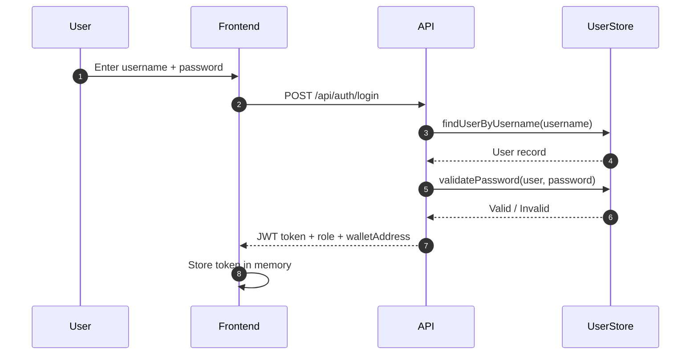

---

## Get Current User

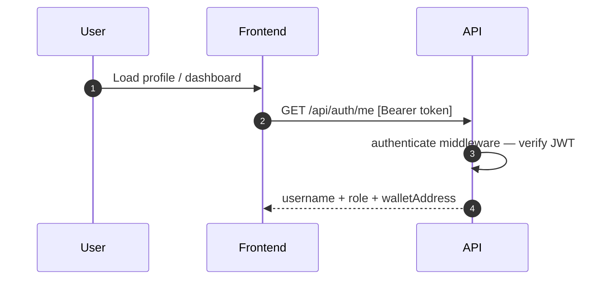

---

## Register Student

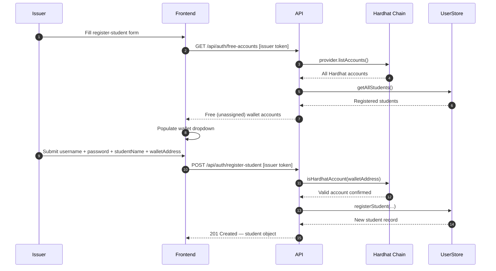

---

## Change Issuer Password

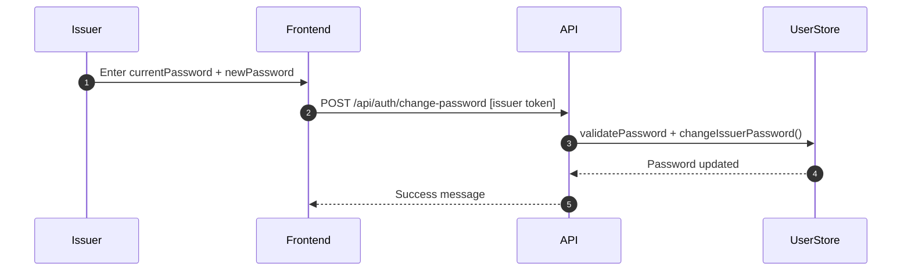

---

## Mint Badge NFT

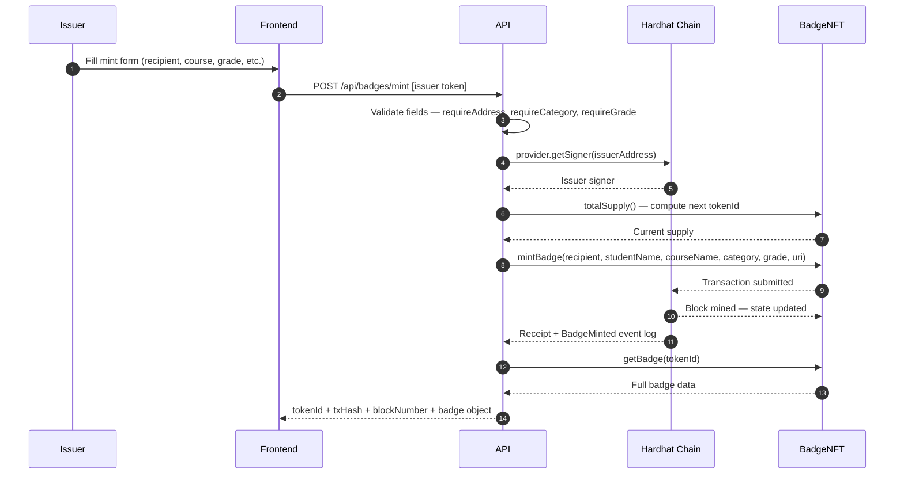

---

## Revoke Badge

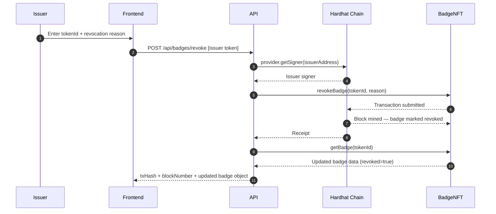

---

## Get Badge by Token ID

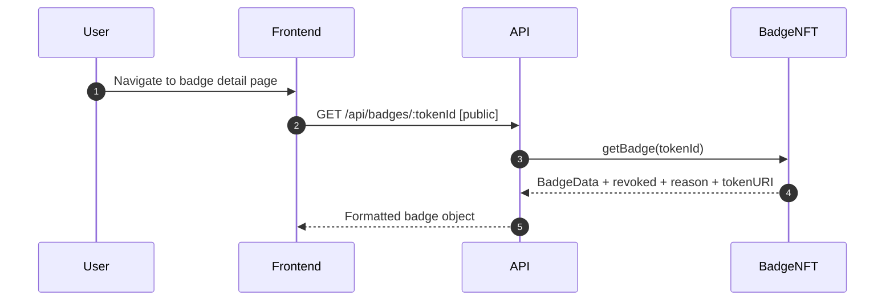

---

## Verify Badge (Public)

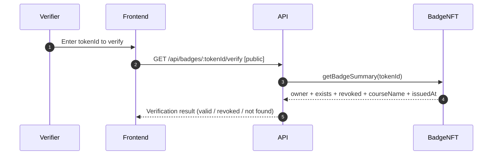

---

## Get Badges by Owner

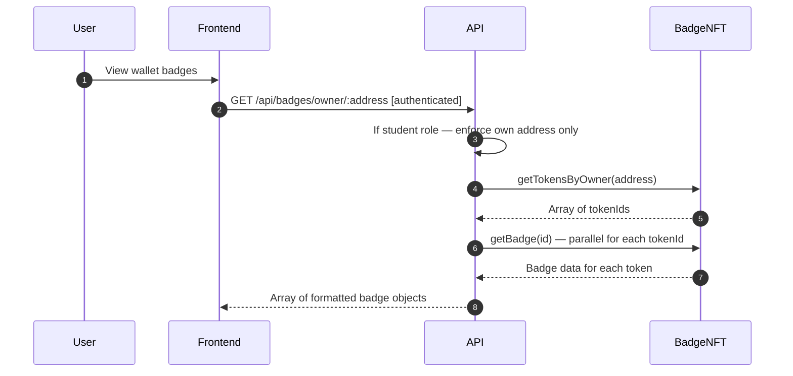

---

## Get NFT Metadata (OpenSea Format)

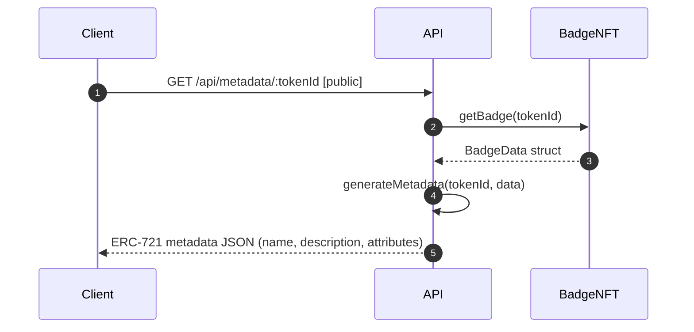

---

## Get Badge History (All Events)

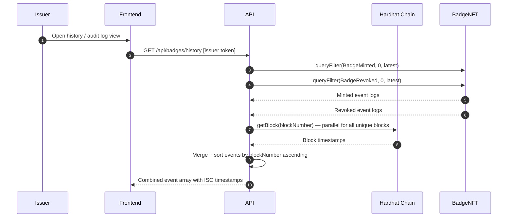

---

## Get Badge Stats

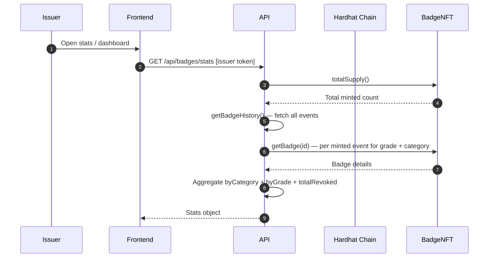

---

## Chain Explorer — Block List

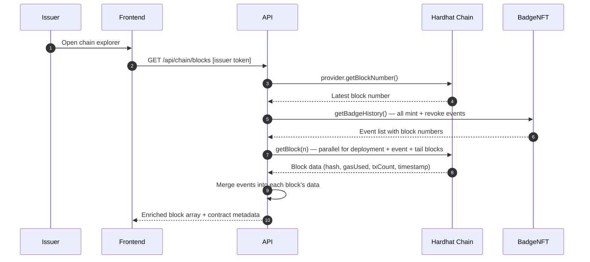

---

## Chain Explorer — Issuer Nonce

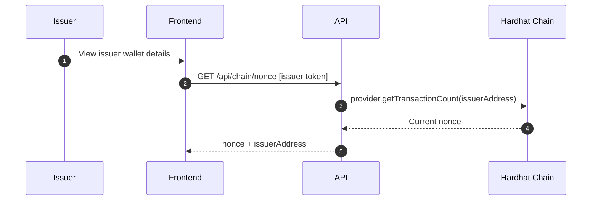

---

## Chain Explorer — Wallet Ledger

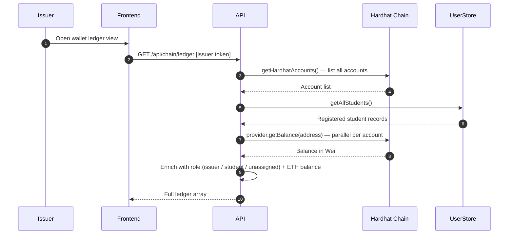

---

## Health Check

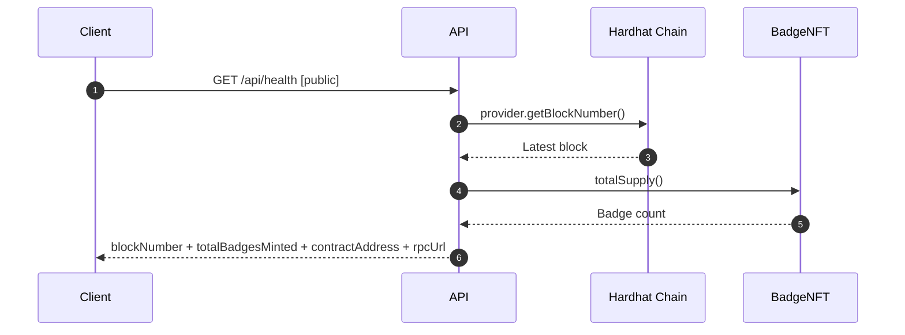

## Table of Contents

1. [Project Overview](#1-project-overview)
2. [Problem Statement](#2-problem-statement)
3. [Why Blockchain is Appropriate](#3-why-blockchain-is-appropriate)
4. [System Architecture](#4-system-architecture)
5. [Project Structure](#5-project-structure)
6. [Smart Contract Design](#6-smart-contract-design)
7. [Backend Stack & API](#7-backend-stack--api)
8. [Frontend Stack](#8-frontend-stack)
9. [Authentication System](#9-authentication-system)
10. [Data Storage — What Lives Where](#10-data-storage--what-lives-where)
11. [The Full Mint Lifecycle](#11-the-full-mint-lifecycle)
12. [API Reference](#12-api-reference)
13. [Key Blockchain Concepts Used](#13-key-blockchain-concepts-used)
14. [Docker & Infrastructure](#15-docker--infrastructure)
15. [Getting Started](#15-getting-started)
16. [Accounts & Wallets](#16-accounts--wallets)
17. [Design Decisions & Trade-offs](#17-design-decisions--trade-offs)
18. [Glossary](#18-glossary)

---

## 1. Project Overview

BadgeNFT is a learning project that demonstrates how blockchain technology can be used to issue verifiable, tamper-proof academic credentials. Instructors (issuers) can mint NFT badges for students who complete courses, and those badges are permanently recorded on a local Ethereum blockchain — they cannot be altered, faked, or transferred.

The system has three components running together via Docker Compose:

- A **local Ethereum blockchain** (Hardhat node) that stores all badge data permanently
- A **Node.js REST API** that acts as the bridge between the frontend and the blockchain
- A **vanilla JavaScript frontend** served by Nginx that provides dashboards for both issuers and students

This project is built entirely for learning blockchain development. It uses a local Hardhat node rather than a real network, so there are no real gas costs, no real ETH, and no real-world financial risk.

---

## 2. Problem Statement

Academic credentials — diplomas, certificates, course completion badges — have a fundamental trust problem. They are issued on paper or as PDFs, both of which can be forged. Verification requires contacting the issuing institution directly, which is slow, manual, and sometimes impossible if the institution no longer exists.

More specifically, the problems are:

**Forgery.** A PDF certificate or paper diploma can be replicated by anyone with basic design tools. There is no cryptographic way to verify that a given certificate was actually issued by the institution named on it.

**Mutability.** A centralized database of credentials can be edited by an administrator, compromised by a hacker, or simply deleted. The record of a student's achievement depends entirely on the integrity and availability of a single organization's server.

**Non-portability.** Credentials are locked in institutional silos. A student needs to request transcripts from each institution separately, often paying fees and waiting days or weeks.

**Revocation opacity.** When a credential is revoked (e.g. due to academic dishonesty), there is no transparent public record of the revocation. The original certificate continues to exist and circulate.

**What BadgeNFT solves:** Each badge is minted as a soul-bound NFT on a blockchain. The issuance record is cryptographically signed by the issuer's private key, permanently stored on an append-only ledger, and publicly verifiable by anyone with the token ID — instantly, with no need to contact the institution.

---

## 3. Why Blockchain is Appropriate

Blockchain is not always the right tool. It is appropriate here for specific, concrete reasons — not because it is trendy.

### Immutability matches the use case

Academic credentials are meant to be permanent records. Blockchain's core property — you can only append, never delete or modify — is exactly what a credential system needs. Once a badge is minted, its issuance record is cryptographically locked into the chain. No database administrator can quietly alter it.

### Cryptographic proof of origin

Every transaction on the blockchain is signed with the issuer's private key. This means anyone can mathematically verify that badge #7 was minted by the specific wallet address `0xf39F...` — and since the contract enforces that only the issuer can call `mintBadge()`, this is proof of authenticity. No PDF can offer this.

### Public verifiability without a trusted third party

Anyone can call `getBadgeSummary(tokenId)` on the contract and instantly see whether a badge exists, who owns it, and whether it has been revoked. No login required, no API key, no institution to contact. The blockchain itself is the source of truth.

### Soul-bound tokens prevent credential trading

A normal NFT can be sold. If badges were transferable NFTs, a student could buy someone else's "Blockchain Fundamentals — Gold" badge. Soul-bound tokens (SBTs) solve this by making transfer impossible at the contract level. The `transfer()`, `approve()`, and `setApprovalForAll()` functions all revert unconditionally. A badge is permanently tied to the wallet it was issued to.

### Transparent revocation audit trail

When a badge is revoked, the revocation event is emitted on-chain with a timestamp, the issuer's address, and the reason. This record is permanent and public. Unlike a centralized database where a record can be silently deleted, blockchain revocation creates an immutable audit trail.

### Where blockchain is NOT used in this project

The login system (usernames, passwords) and the mapping between usernames and wallet addresses are stored in a plain JSON file on the server. This is correct — blockchain is not appropriate for private authentication data. The principle here is: use blockchain for what needs to be public, permanent, and trustless; use conventional storage for everything else.

---

## 4. System Architecture

### Overview

```
┌─────────────────────────────────────────────────────────────┐
│                        Docker Network                        │
│                                                              │
│  ┌──────────────┐    ┌──────────────┐    ┌───────────────┐  │
│  │   Frontend   │    │   API        │    │  Blockchain   │  │
│  │   (Nginx)    │───▶│   (Node.js)  │───▶│  (Hardhat)    │  │
│  │   port 8080  │    │   port 3000  │    │  port 8545    │  │
│  └──────────────┘    └──────────────┘    └───────────────┘  │
│                              │                    ▲          │
│                              │                    │          │
│                      ┌───────────────┐            │          │
│                      │   Deployer    │────────────┘          │
│                      │  (runs once)  │                       │
│                      └───────────────┘                       │
└─────────────────────────────────────────────────────────────┘
```

### Component Responsibilities

| Component | Technology | Responsibility |
|-----------|-----------|----------------|
| Frontend | Nginx + Vanilla JS | Serve HTML/CSS/JS, provide issuer and student dashboards |
| API | Node.js + Express | Handle HTTP, auth, validate inputs, bridge to blockchain |
| Blockchain | Hardhat node | Run local Ethereum chain, store all badge data permanently |
| Deployer | Hardhat script | Compile & deploy `BadgeNFT.sol`, write `localhost.json`, then exit |

### Communication Flow

```
Browser ──HTTP──▶ Nginx (port 8080)
                      │
                      │ Proxy /api/* requests
                      ▼
               Node.js API (port 3000)
                      │
                      │ ethers.js JSON-RPC calls
                      ▼
               Hardhat Node (port 8545)
                      │
                      │ EVM execution
                      ▼
               BadgeNFT.sol (smart contract)
                      │
                      │ Permanent on-chain storage
                      ▼
               mappings: _badges, _owners, _revoked, etc.
```

### Architecture Pattern: Modular Monolith

The API is a **modular monolith** — a single deployable Node.js process divided into strictly separated modules, each owning exactly one responsibility. It is not microservices (no separate services calling each other over a network) and it is not a pure monolith (no tangled logic in one file).

The layers are:

```
┌─────────────────────────────────────────┐
│  HTTP Layer      server.js              │  Routes, req/res, status codes
├─────────────────────────────────────────┤
│  Auth Layer      middleware/auth.js     │  JWT creation & verification
├─────────────────────────────────────────┤
│  Business Logic  badges.js              │  Mint, revoke, fetch, format
│                  userStore.js           │  Users, passwords, registration
│                  accounts.js            │  Hardhat account helpers
│                  metadata.js            │  NFT metadata generation
├─────────────────────────────────────────┤
│  Validation      errors.js             │  Input validation helpers
├─────────────────────────────────────────┤
│  Infrastructure  contract.js            │  Blockchain connection, ABI loading
└─────────────────────────────────────────┘
```

The rule is one-directional: upper layers call downward, lower layers never call upward. `server.js` calls `badges.js`. `badges.js` never calls `server.js`. This prevents the tangling that makes monoliths unmaintainable.

---

## 5. Project Structure

```
badge-nft-platform/
│
├── blockchain/                     # Everything related to the Ethereum chain
│   ├── contracts/
│   │   └── BadgeNFT.sol            # The smart contract (Solidity 0.8.24)
│   ├── scripts/
│   │   └── deploy.js               # Deploys the contract, writes localhost.json
│   ├── deployments/
│   │   └── localhost.json          # Generated after deployment (contract address + ABI)
│   ├── artifacts/                  # Compiled contract output (generated by Hardhat)
│   └── hardhat.config.js           # Hardhat configuration (compiler version, network)
│
├── api/                            # The Node.js REST API
│   ├── src/
│   │   ├── server.js               # Express entry point — all routes live here
│   │   ├── contract.js             # Loads deployment, creates ethers.js contract instances
│   │   ├── badges.js               # Badge business logic (mint, revoke, fetch, history)
│   │   ├── accounts.js             # Hardhat account helpers
│   │   ├── metadata.js             # NFT metadata generation (OpenSea format)
│   │   ├── userStore.js            # Off-chain user/password storage
│   │   ├── errors.js               # Input validation helpers
│   │   └── middleware/
│   │       └── auth.js             # JWT generation and verification middleware
│   ├── deployments/
│   │   └── localhost.json          # Copy of blockchain/deployments/localhost.json (Docker volume)
│   ├── data/
│   │   └── users.json              # Off-chain user database (generated at runtime)
│   └── package.json
│
├── frontend/                       # The browser UI
│   ├── index.html                  # Single HTML page (all panels defined here)
│   ├── app.js                      # All frontend logic (vanilla JS, no framework)
│   └── styles.css                  # All styles
│
├── docker-compose.yml              # Orchestrates all four containers
└── README.md                       # This file
```

---

## 6. Smart Contract Design

### File: `blockchain/contracts/BadgeNFT.sol`

The smart contract is the core of the entire system. It is written in Solidity 0.8.24 and compiled by Hardhat into EVM bytecode. Once deployed, its code and stored data are permanent and unmodifiable.

### Data Model

The contract stores badge data in a custom struct:

```solidity
struct BadgeData {
    string  studentName;   // Full name of the student
    string  courseName;    // Name of the completed course
    string  category;      // "Blockchain" | "Web Dev" | "Security" | "Data Science"
    string  grade;         // "Bronze" | "Silver" | "Gold"
    address recipient;     // Wallet address of the student
    uint256 issuedAt;      // Unix timestamp from block.timestamp at mint time
    bool    exists;        // True for all minted tokens; distinguishes real from empty mapping slots
}
```

This struct is stored in a Solidity mapping — essentially a hash map that lives permanently on-chain:

```solidity
mapping(uint256 => BadgeData) private _badges;
```

There are five additional mappings supporting ownership, revocation, and metadata:

```solidity
mapping(uint256 => address)   private _owners;             // tokenId → owner wallet
mapping(address => uint256[]) private _ownedTokens;         // wallet → list of token IDs
mapping(uint256 => string)    private _tokenURIs;           // tokenId → metadata URL
mapping(uint256 => bool)      private _revoked;             // tokenId → revocation flag
mapping(uint256 => string)    private _revocationReasons;   // tokenId → revocation reason
```

### Access Control

The contract uses the `onlyIssuer` modifier to restrict minting and revocation to a single authorized address:

```solidity
address public immutable issuer;  // Set once in constructor, can never change

modifier onlyIssuer() {
    require(msg.sender == issuer, "Only issuer can perform this action.");
    _;
}
```

`msg.sender` is the wallet address that cryptographically signed the transaction. It cannot be faked. `immutable` means the issuer address is baked into the contract bytecode at deployment time and cannot be changed by anyone, including the issuer.

### Soul-Bound Enforcement

Transfers are made impossible by overriding the standard transfer functions with unconditional reverts:

```solidity
function transfer(address, uint256) external pure {
    revert("Badges are non-transferable soul-bound tokens.");
}

function approve(address, uint256) external pure {
    revert("Badges are non-transferable soul-bound tokens.");
}

function setApprovalForAll(address, bool) external pure {
    revert("Badges are non-transferable soul-bound tokens.");
}
```

These functions accept arguments (to match expected signatures) but do nothing with them. Any attempt to transfer a badge from any wallet, through any mechanism, will fail at the contract level.

### Events

Two events are emitted and permanently recorded in the blockchain's transaction logs:

```solidity
event BadgeMinted(
    uint256 indexed tokenId,
    address indexed recipient,
    string  courseName,
    string  category,
    address indexed issuer
);

event BadgeRevoked(
    uint256 indexed tokenId,
    string  reason,
    address indexed issuer
);
```

`indexed` fields can be filtered efficiently — you can query "all badges minted for recipient `0xABC...`" without scanning the entire event log. Non-indexed fields (like `courseName` and `reason`) are stored in the log data but cannot be used as filters.

### Read vs Write Functions

| Function | Type | Description |
|----------|------|-------------|
| `mintBadge()` | `external onlyIssuer` | Creates a new badge NFT |
| `revokeBadge()` | `external onlyIssuer` | Marks a badge as revoked |
| `getBadge()` | `external view` | Returns full badge data + revocation info |
| `getBadgeSummary()` | `public view` | Safe summary that never reverts |
| `getTokensByOwner()` | `public view` | Returns all token IDs for a wallet |
| `ownerOf()` | `public view` | Returns the owner of a token |
| `tokenURI()` | `public view` | Returns the metadata URL for a token |
| `isRevoked()` | `public view` | Returns the revocation status |
| `totalSupply` | `public` (state var) | Auto-generated getter for total minted count |

`view` functions do not modify state, require no transaction, cost no gas, and return immediately. Write functions (`mintBadge`, `revokeBadge`) require a signed transaction, get mined into a block, and permanently alter the chain's state.

### Why Revocation Doesn't Delete Data

On a blockchain, data cannot be deleted — the chain is append-only by design. Revocation sets `_revoked[tokenId] = true` and stores the reason string. The original `BadgeData` struct remains fully intact and readable forever. This is intentional: it creates an immutable audit trail showing that the badge existed, was issued, and was subsequently revoked with a stated reason.

---

## 7. Backend Stack & API

### Technology

| Tool | Version | Purpose |
|------|---------|---------|
| Node.js | 18+ | JavaScript runtime |
| Express | 4.x | HTTP server and routing |
| ethers.js | 6.x | Ethereum interaction library |
| bcrypt | 5.x | Password hashing |
| jsonwebtoken | 9.x | JWT creation and verification |
| dotenv | 16.x | Environment variable loading |

### File-by-File Breakdown

**`server.js`** — The entry point and only HTTP-aware file in the project. It defines all routes, parses request bodies, applies middleware, and shapes JSON responses. It contains no business logic — it only calls into other modules and translates their results into HTTP responses. On startup, it tries up to 5 times (with 2-second delays) to find `localhost.json`, because the deployer container may still be running when the API starts.

**`contract.js`** — Creates ethers.js contract instances from the deployment file. Returns read-only instances (connected to a `JsonRpcProvider`) for query operations, and signer-connected instances (connected to `provider.getSigner(issuerAddress)`) for write operations. Every other module that needs blockchain access calls this file — nothing else imports ethers.js directly.

**`badges.js`** — Contains all badge-related business logic. Completely decoupled from HTTP: takes contract/provider instances as function arguments and returns plain JavaScript objects. Could be used in a CLI or test suite without any changes. The key functions are `mintBadge`, `revokeBadge`, `getBadge`, `getBadgesByOwner`, `getBadgeHistory`, and `getBadgeStats`.

**`userStore.js`** — Manages the off-chain user database stored in `api/data/users.json`. Handles registration, login lookup, password validation with bcrypt, and password changes. Initializes on startup with a default issuer account (`issuer` / `issuer1234`) linked to the deployer wallet address.

**`accounts.js`** — Thin helpers over `provider.listAccounts()`. The most important function is `isHardhatAccount()`, used during student registration to verify that the provided wallet address is actually one of the 10 Hardhat accounts — preventing registration with arbitrary addresses that would make badge minting impossible.

**`metadata.js`** — Generates NFT metadata JSON in the OpenSea standard format. Called on every request to `/api/metadata/:tokenId`. The metadata is never stored — it is reconstructed from on-chain data each time. Uses the DiceBear Shapes API to generate a deterministic SVG image based on the badge category and token ID.

**`errors.js`** — Pure validation functions. `requireText()`, `requireAddress()`, `requireTokenId()`, `requireCategory()`, `requireGrade()` all throw descriptive errors if their input is invalid. `normalizeError()` converts any thrown value into a plain string for safe JSON serialization.

**`middleware/auth.js`** — JWT middleware. `generateToken(user)` signs a JWT containing the user's username, role, and wallet address. `authenticate` verifies the JWT on incoming requests and attaches the decoded payload to `req.user`. `requireRole(role)` returns middleware that checks `req.user.role` matches the required role.

### Error Handling Pattern

Every route in `server.js` wraps its logic in try/catch. On error, it calls `normalizeError(err)` and returns a JSON response with `ok: false` and a descriptive message. All successful responses include `ok: true`. This consistent envelope makes frontend error handling simple and predictable.

---

## 8. Frontend Stack

The frontend is intentionally simple — no framework, no build step, no bundler. It is three files.

### Technology

| File | Purpose |
|------|---------|
| `index.html` | Defines all UI panels and elements |
| `app.js` | All application logic in vanilla JavaScript |
| `styles.css` | All visual styles |

Served by **Nginx** on port 8080. Nginx also proxies all `/api/*` requests to the Node.js API on port 3000, so the browser only ever talks to one host.

### UI Structure

The UI has three top-level panels, only one of which is visible at a time:

**Login panel** — Username and password form. On successful login, the JWT is stored in memory (a JavaScript variable, not localStorage) and the appropriate dashboard is shown.

**Issuer dashboard** — Five tabs:
- **Mint Badge** — Form to issue a new badge. Shows the six-step transaction lifecycle strip (Fill Form → API Validates → Tx Signed → On-Chain Mint → Event Emitted → Badge Issued).
- **Students** — List of registered students with a registration form. The wallet dropdown is populated from `/api/auth/free-accounts` so only unassigned Hardhat wallets are shown.
- **Gallery** — Look up all badges for any wallet address, with sort controls (by grade tier, date, or course name).
- **History** — Full event log of every `BadgeMinted` and `BadgeRevoked` event from the chain.
- **Blockchain** — Chain explorer showing real block data and a wallet ledger with ETH balances.

**Student dashboard** — Two tabs:
- **My Badges** — The student's own badge gallery, loaded automatically on login.
- **Verify Token** — Public lookup by token ID. Shows existence, owner, and revocation status.

### State Management

All state is held in JavaScript module-level variables: the current JWT token, the logged-in user's role and wallet address, the current badge array for sorting, and UI state flags. There is no localStorage usage and no cookies — the JWT is held only in memory, so it is cleared on page refresh (requiring re-login). This is a deliberate simplification appropriate for a learning project.

### Badge Card Sorting

The gallery sort works by maintaining a raw badge array fetched from the API and re-rendering it client-side when the sort control changes. Grade sorting uses a priority map `{ Gold: 3, Silver: 2, Bronze: 1 }` to order numerically. Date sorting uses the `issuedAt` Unix timestamp. Course sorting uses `localeCompare()` for alphabetical order. No additional API call is made on sort — it operates on the already-fetched data.

---

## 9. Authentication System

Authentication is a hybrid: off-chain credentials for the login system, on-chain cryptographic identity for blockchain operations.

### Login Flow

```
User submits username + password
        │
        ▼
server.js finds user in userStore.js (JSON file lookup)
        │
        ▼
bcrypt.compare(submittedPassword, storedHash)
        │
        ▼
If valid: generateToken(user) → JWT signed with secret key
        │
        ▼
JWT returned to frontend, stored in JS variable
        │
        ▼
All subsequent requests include: Authorization: Bearer <token>
        │
        ▼
authenticate middleware verifies JWT signature on every protected route
```

### Roles

There are exactly two roles:

**`issuer`** — Can mint badges, revoke badges, register students, view all students, access the chain explorer, and view all wallet addresses. There is exactly one issuer account, created automatically on startup linked to the deployer wallet (Account #0).

**`student`** — Can view their own badges only. Cannot view other students' badges. Cannot mint or revoke. There can be up to 9 student accounts (one per available Hardhat wallet).

### The Two-Layer Identity

Each user has both an off-chain identity (username + password in `users.json`) and an on-chain identity (an Ethereum wallet address). These are linked: when a student is registered, their username is permanently associated with one of the 9 Hardhat wallet addresses. When the issuer mints a badge, the recipient is specified by wallet address — the blockchain knows nothing about usernames. The API bridges these two identity systems: it looks up the student's wallet address from the user store and passes it to the contract.

### Password Security

Passwords are hashed with bcrypt at cost factor 10 before being stored. bcrypt is a deliberately slow algorithm, making brute-force attacks impractical. Plain-text passwords are never stored anywhere. The default issuer password (`issuer1234`) should be changed through the Settings panel in a real deployment.

---

## 10. Data Storage — What Lives Where

Understanding this is critical to understanding the system.

### On the Blockchain (Hardhat node in-memory state)

Everything in these Solidity mappings:
- All `BadgeData` structs (student name, course, category, grade, recipient, timestamp)
- Token ownership records (`_owners`, `_ownedTokens`)
- Metadata URIs (`_tokenURIs`)
- Revocation flags and reasons (`_revoked`, `_revocationReasons`)
- Total supply counter
- All event logs (`BadgeMinted`, `BadgeRevoked`) with block numbers and transaction hashes

**Important:** Because this is a local Hardhat node (not a real network), this data only persists while the container is running. Restarting the chain wipes everything and requires redeployment.

### On the API Server Filesystem

- `api/data/users.json` — Usernames, bcrypt-hashed passwords, roles, and wallet address associations
- `api/deployments/localhost.json` — Contract address, deployer address, deployment block, and ABI (written by the deployer container, read by the API on every startup)

### Generated on Every Request (Never Stored)

- NFT metadata JSON (generated by `metadata.js` from on-chain badge data on each `/api/metadata/:tokenId` request)

### In Browser Memory Only

- The JWT auth token (cleared on page refresh)
- The current badge gallery array (re-fetched on each tab switch)

### Summary Table

| Data | Where Stored | Persistent? |
|------|-------------|-------------|
| Badge content (name, course, grade) | Blockchain | Until chain restart |
| Badge ownership | Blockchain | Until chain restart |
| Revocation records | Blockchain | Until chain restart |
| Event history | Blockchain | Until chain restart |
| User accounts & passwords | `api/data/users.json` | Yes (filesystem) |
| Contract address & ABI | `deployments/localhost.json` | Until redeployment |
| NFT metadata JSON | Generated per-request | Never |
| Auth JWT | Browser memory | Until page refresh |

---

## 11. The Full Mint Lifecycle

This is the complete journey from clicking "Mint Badge" to the badge appearing on-chain.

```
Step 1 — Frontend form submission
  app.js collects: recipient address, student name, course, category, grade
  app.js sends: POST /api/badges/mint
                Authorization: Bearer <jwt>
                Body: { recipient, studentName, courseName, category, grade }

Step 2 — API authentication
  authenticate middleware verifies JWT signature
  requireRole("issuer") confirms role === "issuer"
  If either fails → 401 or 403 response, stops here

Step 3 — Input validation (errors.js)
  requireAddress(recipient)    → must be 0x + 40 hex chars
  requireText(studentName)     → must be non-empty string
  requireText(courseName)      → must be non-empty string
  requireCategory(category)    → must be one of the four allowed values
  requireGrade(grade)          → must be Bronze | Silver | Gold
  If any fail → 400 response with specific error message

Step 4 — Contract instance creation (contract.js)
  Reads localhost.json for contract address and ABI
  Creates JsonRpcProvider connected to http://chain:8545
  Gets issuer signer via provider.getSigner(deployerAddress)
  Returns signer-connected contract instance

Step 5 — Badge minting (badges.js)
  Reads totalSupply to predict next token ID
  Computes metadata URI: http://localhost:3000/api/metadata/<nextId>
  Calls contract.connect(issuerSigner).mintBadge(
    recipient, studentName, courseName, category, grade, uri
  )
  ethers.js encodes arguments using ABI and signs transaction with issuer private key
  Transaction is broadcast to Hardhat node

Step 6 — EVM execution (BadgeNFT.sol)
  onlyIssuer modifier: require(msg.sender == issuer)
  Six require() checks on input validity
  totalSupply += 1
  tokenId = totalSupply
  _owners[tokenId] = recipient
  _ownedTokens[recipient].push(tokenId)
  _tokenURIs[tokenId] = uri
  _badges[tokenId] = BadgeData{ studentName, courseName, category, grade,
                                 recipient, block.timestamp, exists: true }
  emit BadgeMinted(tokenId, recipient, courseName, category, issuer)
  Transaction is mined into a new block

Step 7 — Receipt processing (badges.js)
  tx.wait() returns the transaction receipt
  Receipt logs are parsed to find the BadgeMinted event
  Canonical tokenId is extracted from event args
  getBadge(tokenId) is called to fetch complete badge data from chain

Step 8 — Response (server.js → frontend)
  API returns: { ok: true, tokenId, txHash, blockNumber, badge: { ... } }
  app.js displays the result card with Token ID, Tx Hash, and Block Number
  Badge is now permanently on-chain
```

---

## 12. API Reference

All API endpoints are prefixed with `/api`. Protected endpoints require `Authorization: Bearer <token>` header.

### Auth Endpoints

| Method | Path | Auth | Description |
|--------|------|------|-------------|
| `POST` | `/api/auth/login` | None | Login with username and password |
| `GET` | `/api/auth/me` | Any | Get current user info from JWT |
| `POST` | `/api/auth/register-student` | Issuer | Register a new student account |
| `GET` | `/api/auth/students` | Issuer | List all registered students |
| `GET` | `/api/auth/free-accounts` | Issuer | List unassigned Hardhat wallets |
| `POST` | `/api/auth/change-password` | Issuer | Change issuer password |

### Badge Endpoints

| Method | Path | Auth | Description |
|--------|------|------|-------------|
| `POST` | `/api/badges/mint` | Issuer | Mint a new badge NFT |
| `POST` | `/api/badges/revoke/:tokenId` | Issuer | Revoke a badge |
| `GET` | `/api/badges/history` | Issuer | Full on-chain event history |
| `GET` | `/api/badges/stats` | Issuer | Badge statistics by category and grade |
| `GET` | `/api/badges/owner/:address` | Any* | Get all badges for a wallet address |
| `GET` | `/api/badges/:tokenId` | None | Get full badge data by token ID |
| `GET` | `/api/badges/:tokenId/verify` | None | Public verification (never throws) |
| `GET` | `/api/metadata/:tokenId` | None | OpenSea-format NFT metadata |

*Students can only request their own address.

### Chain Explorer Endpoints

| Method | Path | Auth | Description |
|--------|------|------|-------------|
| `GET` | `/api/chain/blocks` | Issuer | Real block data with badge events |
| `GET` | `/api/chain/ledger` | Issuer | ETH balances for all Hardhat accounts |

### Response Format

All badge and auth endpoints return a consistent envelope:

```json
{
  "ok": true,
  "data": "..."
}
```

On error:

```json
{
  "ok": false,
  "message": "Descriptive error message"
}
```

The `/api/metadata/:tokenId` endpoint is the exception — it returns raw OpenSea-format JSON with no `ok` wrapper, because external tools (wallets, marketplaces) expect that exact format.

---

## 13. Key Blockchain Concepts Used

### Ethereum Virtual Machine (EVM)

The runtime environment that executes smart contract bytecode. Every Hardhat node is a local EVM. Functions marked `view` are executed locally (no gas, no transaction). Functions that write state must be submitted as a transaction, mined into a block, and cost gas.

### Gas

Gas is the unit of computational work on Ethereum. Every EVM instruction costs a certain amount of gas. Write transactions require gas — paid in ETH — to prevent spam and compensate miners/validators. On the local Hardhat node, the pre-funded accounts have 10,000 ETH, so gas is never a practical concern. In a real deployment, every `mintBadge` call would cost real ETH.

### Transaction Hash

A unique identifier for every transaction, derived by hashing the transaction data. The mint result includes the transaction hash so anyone can look it up on a block explorer (on a real network) and verify it happened.

### Block Number

Every block on the chain has a sequential number. The badge records when it was minted (which block it was in), and that block has a timestamp. This gives every badge an unforgeable, chain-verifiable issuance time.

### ABI (Application Binary Interface)

The JSON description of a contract's public interface. It lists every function (name, parameter types, return types) and every event (name, parameter types, which are indexed). ethers.js uses the ABI to encode JavaScript function calls into the binary format the EVM expects, and to decode binary return values back into JavaScript. Without the ABI, the contract is a black box.

### Event Logs

Solidity events are stored in the transaction receipt, not in contract storage. They are cheaper to write than state variables and efficient to query. The `getBadgeHistory()` function uses `contract.queryFilter()` to read all `BadgeMinted` and `BadgeRevoked` events from the beginning of the chain, which is how the History tab reconstructs the full audit trail without storing anything extra.

### Immutability (`immutable` keyword)

The `issuer` address is declared `immutable`, meaning it is set once in the constructor and baked into the contract bytecode. It cannot be changed by a function call, a contract upgrade, or any other mechanism. This is stronger than a regular state variable, which could theoretically be changed by a setter function.

### `msg.sender`

A global variable available in every Solidity function call. It contains the Ethereum address that signed and sent the current transaction. It is cryptographically verified by the EVM — it is impossible to fake. This is why `require(msg.sender == issuer)` is a reliable access control mechanism.

---

## 14. Docker & Infrastructure

### Containers

The project runs four Docker containers defined in `docker-compose.yml`:

**`chain`** — Runs `npx hardhat node`. Starts the local Ethereum node on port 8545. Pre-funds 10 accounts with 10,000 ETH each. Stays running for the lifetime of the system. Other containers connect to it as `http://chain:8545`.

**`deployer`** — Runs `deploy.js` once. Compiles `BadgeNFT.sol`, deploys it to the chain container, writes `localhost.json` to a shared volume, then exits with code 0. It depends on the chain being healthy before starting.

**`api`** — Runs the Node.js Express server. Depends on the deployer having finished (reads `localhost.json` from the shared volume). Retries up to 5 times on startup if the deployment file isn't ready yet.

**`frontend`** — Runs Nginx serving the three frontend files. Configured to proxy all `/api/*` requests to the API container, so the browser only needs to know about port 8080.

### Shared Volume

The deployer and API containers share a Docker volume mounted at `/api/deployments/`. The deployer writes `localhost.json` to this volume, and the API reads it. This is the only coupling between the two containers.

### Environment Variables

| Variable | Default | Description |
|----------|---------|-------------|
| `RPC_URL` | `http://chain:8545` | URL of the Hardhat node |
| `PORT` | `3000` | API server port |
| `JWT_SECRET` | (set in compose) | Secret key for signing JWTs |

---

## 15. Getting Started

### Prerequisites

- Docker and Docker Compose installed
- No other services running on ports 8080, 3000, or 8545

### Run the Project

```bash
# Clone the repository
git clone <repository-url>
cd badge-nft-platform

# Start all containers
docker compose up --build

# Wait for all four containers to finish starting.
# You will see a line like:
# deployer  | ✓ BadgeNFT deployed successfully.
# api       | [API] Badge NFT API running on port 3000

# Open the frontend
open http://localhost:8080
```

### Default Login

```
Username: issuer
Password: issuer1234
```

### First Steps

1. Log in as the issuer
2. Go to the **Students** tab and register a student (a wallet from the dropdown will be auto-assigned)
3. Go to the **Mint Badge** tab, select the student's wallet, fill in course details, and click Mint
4. Log out and log in as the student to see their badge in **My Badges**
5. Use **Verify Token** with the token ID to see public verification in action
6. Return to the issuer account and explore the **History** and **Blockchain** tabs

### Stopping the Project

```bash
docker compose down
```

Note: stopping the chain container wipes all on-chain data. User accounts in `api/data/users.json` persist on your filesystem.

### Redeploying the Contract

If you restart the chain, you must redeploy:

```bash
docker compose down
docker compose up --build
```

This re-runs the deployer and writes a new `localhost.json` with the new contract address.

---

## 16. Accounts & Wallets

Hardhat automatically creates 10 deterministic accounts every time it starts, always at the same addresses with the same private keys (they are derived from a fixed seed mnemonic). This is intentional for development — predictability is more useful than security on a local chain.

| Account | Address | Role |
|---------|---------|------|
| Account #0 | `0xf39Fd6e51aad88F6F4ce6aB8827279cffFb92266` | Issuer (deployer) |
| Account #1 | `0x70997970C51812dc3A010C7d01b50e0d17dc79C8` | Available for students |
| Account #2 | `0x3C44CdDdB6a900fa2b585dd299e03d12FA4293BC` | Available for students |
| Account #3 | `0x90F79bf6EB2c4f870365E785982E1f101E93b906` | Available for students |
| Accounts #4–#9 | (see Hardhat output) | Available for students |

The issuer (Account #0) is the only account that can call `mintBadge()` and `revokeBadge()`. This is enforced at the contract level — any transaction signed by any other account calling those functions will be rejected by the `onlyIssuer` modifier.

There are 9 available student accounts (not 10) because Account #0 is reserved as the issuer. You cannot register a student with Account #0's address.

---

## 17. Design Decisions & Trade-offs

### Why vanilla JavaScript for the frontend?

No build step, no bundler, no framework to learn. For a blockchain learning project, adding React or Vue would introduce complexity that obscures what the project is trying to demonstrate. The frontend is deliberately simple so attention stays on the blockchain layer.

### Why a local Hardhat node instead of a testnet?

Speed and zero cost. A local node mines blocks instantly and the 10 pre-funded accounts have unlimited fake ETH. Deploying to a real testnet like Sepolia would require faucet ETH, real wait times for block confirmation, and an Alchemy/Infura API key. These barriers have nothing to do with what the project is teaching.

### Why store user accounts off-chain?

Usernames and passwords have no place on a public blockchain. Storing them on-chain would make them permanently public and readable by anyone. Off-chain storage in a JSON file is correct for private authentication data. The blockchain stores only what needs to be public and permanent.

### Why does the metadata endpoint generate on every request?

The metadata JSON contains the badge data already stored on-chain. Caching it would mean maintaining a second copy of data that already has a canonical source. Generating it fresh on each request keeps the system simple and ensures the metadata is always consistent with the on-chain state.

### Why no ERC-721 inheritance?

Standard ERC-721 contracts inherit from OpenZeppelin's library, which includes all the transfer and approval logic. Since this contract is soul-bound (non-transferable), using ERC-721 would mean inheriting logic that immediately needs to be overridden. It's cleaner and more instructive to write the minimal NFT logic from scratch, which makes the soul-bound design explicit rather than hidden behind overrides.

### Why store the ABI in localhost.json?

The ABI is the interface definition for the contract. Storing it in the deployment file means the API always has the correct ABI for the exact version of the contract that is deployed. If the contract is redeployed after a code change, the new ABI is automatically written to the file and the API picks it up on the next startup.

---

## 18. Glossary

| Term | Definition |
|------|------------|
| **ABI** | Application Binary Interface. JSON description of a contract's functions and events, used by ethers.js to encode and decode calls. |
| **Address** | A 42-character hex string (e.g. `0xf39F...`) that identifies a wallet or contract on the blockchain. Derived from a public key. |
| **Block** | A batch of transactions grouped together and added to the chain. Has a number, timestamp, hash, and parent hash. |
| **Blockchain** | An append-only distributed ledger. Data is organized into chained blocks. Once written, data cannot be altered. |
| **Bytecode** | The compiled binary output of a Solidity contract. This is what actually runs on the EVM. |
| **Contract** | A program deployed on the blockchain. Has its own address, can store state, and exposes functions. |
| **Deploy** | The act of sending a contract's bytecode to the blockchain, creating it at a specific address. |
| **EVM** | Ethereum Virtual Machine. The runtime that executes contract bytecode. Every Ethereum-compatible node runs one. |
| **ethers.js** | A JavaScript library for interacting with Ethereum nodes — creating providers, signers, and contract instances. |
| **Event** | A Solidity construct that writes a log entry to the transaction receipt. Cheaper than state storage; queryable by clients. |
| **Gas** | The unit of computational work on Ethereum. Write transactions cost gas (paid in ETH). Read calls are free. |
| **Hardhat** | A development environment for Ethereum. Compiles Solidity, runs a local node, and deploys contracts. |
| **Hash** | A fixed-length fingerprint of arbitrary data. Used for block chaining and transaction identification. |
| **Immutable** | A Solidity keyword meaning a variable is set once in the constructor and can never be changed again. |
| **JWT** | JSON Web Token. A signed token containing user claims (role, username, wallet). Used for API authentication. |
| **Mapping** | A Solidity data structure similar to a hash map. Stores key-value pairs permanently on-chain. |
| **Metadata** | A JSON object describing an NFT — its name, image, description, and attributes. Stored off-chain via a URI. |
| **`msg.sender`** | The wallet address that signed the current transaction. Cryptographically verified; cannot be faked. |
| **Modifier** | A Solidity construct that wraps a function with reusable logic (e.g. access control checks). |
| **Monolith** | A single deployable application unit. A modular monolith is internally organized into clean modules. |
| **NFT** | Non-Fungible Token. A unique, non-interchangeable token identified by a token ID. |
| **Private Key** | A secret 256-bit number that authorizes transactions from a wallet. Never shared; cannot be recovered if lost. |
| **Provider** | An ethers.js object that connects to a node for read-only operations. |
| **Public Key** | Derived from the private key. Used to generate the wallet address. |
| **Receipt** | A record returned after a transaction is mined. Contains the block number, gas used, and event logs. |
| **Revoke** | Flagging a badge as invalid. The badge data remains on-chain (it cannot be deleted), but is marked revoked. |
| **Signer** | An ethers.js object that can sign and broadcast transactions using a wallet's private key. |
| **Solidity** | The programming language for Ethereum smart contracts. Statically typed, compiled to EVM bytecode. |
| **Soul-Bound Token (SBT)** | An NFT that cannot be transferred. Permanently tied to the wallet it was issued to. |
| **Struct** | A Solidity custom data type that groups related fields together (like a class with only data, no methods). |
| **Token ID** | A unique integer identifying a specific NFT within a contract. In this project, starts at 1 and increments. |
| **Transaction** | A signed message sent to the blockchain requesting a state change. Costs gas; gets mined into a block. |
| **URI** | Uniform Resource Identifier. The metadata URL stored per token — points to the `/api/metadata/:tokenId` endpoint. |
| **Wallet** | A public/private key pair. The public key generates an address; the private key signs transactions. |
| **`view` function** | A Solidity function that only reads state. No transaction needed, no gas cost, instant response. |

---

**Reset everything**
```bash
docker compose down -v
docker compose up -d chain
docker compose run --rm deployer
docker compose up -d api frontend
```